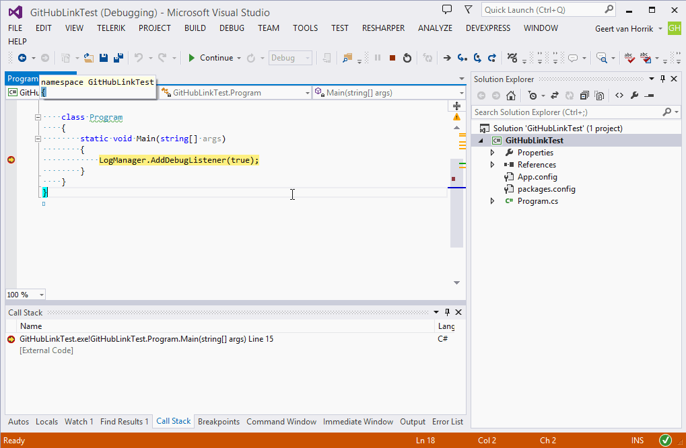
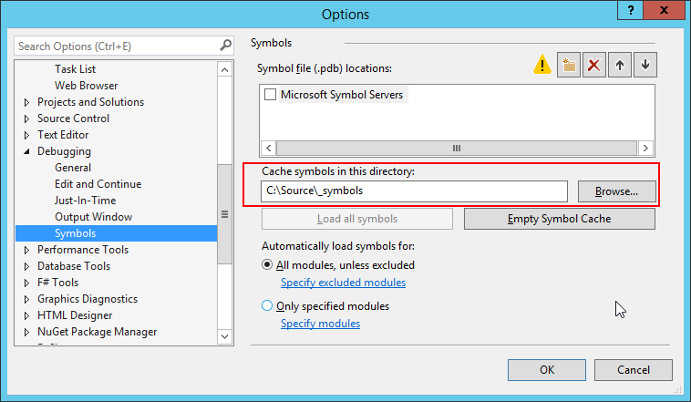

GitLink
==========

[][NuGetDownload]
[][NuGetDownload]

GitLink lets users step through your code hosted on GitHub! **Help make .NET open source projects more accessible by enabling this for your .NET projects, it's just a single additional step in your build**. See the list of [projects using GitLink](#projects-using-gitlink).

-- 

**Important** 

*GitLink* was formerly named *GitHubLink*. By adding support to more Git hosting services the name seemed not covering the whole package. The old GitHubLink packages on NuGet and Chocolatey will no longer be updated or maintained.

*Private git repositories* might be problematic. [More info](#source-stepping-returns-html).

--

GitLink makes symbol servers obsolete which saves you both time with uploading source files with symbols and the user no longer has to specify custom symbol servers (such as symbolsource.org).

  

The advantage of GitLink is that it is fully customized for Git. It also works with GitHub or BitBucket urls so it **does not require a local git repository to work**. This makes it perfectly usable in continuous integration servers such as <a href="http://www.finalbuilder.com/Continua-CI" target="_blank">Continua CI</a>.

Updating all the pdb files is very fast. A solution with over 85 projects will be handled in less than 30 seconds.

When using GitLink, the user no longer has to specify symbol servers. The only requirement is to ensure the check the `Enable source server support` option in Visual Studio as shown below:

  

# How to use GitLink to enable source stepping on your own projects

## NuGet/MSBuild integration

The simplest way to use GitLink is to [install its NuGet package][NuGetDownload] into your project.

    Install-Package GitLink

Once installed, it automatically integrates with MSBuild to add source download instructions to your PDB.

## Command line tool

If you want to install the tool on your (build) computer, the package is available via <a href="https://chocolatey.org/" target="_blank">Chocolatey</a>. To install, use the following command:

    choco install gitlink

Using GitLink via the command line is very simple:

    gitlink.exe <pdbfile>

### Running for a custom raw content URL

When working with a content proxy or an alternative git VCS system that supports direct HTTP access to specific file revisions use the `-u` parameter with the custom raw content root URL

    GitLink.exe <pdbfile> -u https://raw.githubusercontent.com/catel/catel
    
The custom url will be used to fill in the following pattern `{customUrl}/{revision}/{relativeFilePath}` when generating the source mapping.

When working with a repository using uncommon URL you can use placeholders to specify where the filename and revision hash should be, use `-u` parameter with the custom URL

    GitLink.exe <pdbfile> -u "https://host/projects/catel/repos/catel/browse/{filename}?at={revision}&raw"

The custom url will be used to fill the placeholders with the relative file path and the revision hash.

### Git repository location

GitLink resolves the git repository based on the location of the pdb file. If the pdb file is located outside of the git repository, use the `-baseDir` parameter to point to the top-level directory of the repository.

### Native PDBs

Native PDBs (from C++ projects) are supported by using -a option:

    GitLink.exe <nativePdbfile> -a

All known C++ source files from your git depot will be indexed in the PDB.

### More options

There are many more parameters you can use. Display the usage doc with the following command line:

    GitLink.exe -h

# How does it work

The SrcSrv tool (Srcsrv.dll) enables a client to retrieve the exact version of the source files that were used to build an application. Because the source code for a module can change between versions and over the course of years, it is important to look at the source code as it existed when the version of the module in question was built.

For more information, see the <a href="http://msdn.microsoft.com/en-us/library/windows/hardware/ff558791(v=vs.85).aspx" target="_blank">official documentation of SrcSrv</a>.

GitLink creates a source index file and updates the PDB file so it will retrieve the files from the Git host file handler.
To do this, GitLink must be aware of the public URL from which the source files you compiled with can be retrieved.
GitLink.exe reads your compiler-generated PDB, which already contains full paths to your local source files.
It then searches for a git repo that contains those source files and looks up the commit that HEAD points to.
It also searches your remotes for a URL pattern that it recognizes (e.g. https://github.com/name/repo).
It combines the URL and the commit ID to create a unique URL for each source file of this exact version, and adds this information to your PDB.

When you share your PDB alongside your assembly, your users who debug with Source Server support enabled will automatically be able to step into your source code. 

# Troubleshooting

## Source Stepping isn't working

* Visual Studio 2012 needs to run elevated in order to download the source server files

* Specify a value for Visual Studio -> Options -> Debugging -> Symbols -> `Cache Symbols in this directory`

## Source Stepping returns HTML
If your repository is private, you are likely seeing the logon HTML from your git host.

* Log onto your git host in Internet Explorer
* Purge your local symbol cache

Note that this approach is not guaranteed to work.  Visual Studio needs to authenticate to retrieve the source files
but does not ask the user for credentials to do so.  There are ways to work around this, but no mechanism is currently
provided out-of-the-box in *GitLink*.

Possible workarounds
* Include a mechanism in the pdb to retrieve credentials (using PowerShell and Windows credentials store) (see [#37](https://github.com/GitTools/GitLink/issues/37))
* Use a proxy service that does not require authentication (see [#66](https://github.com/GitTools/GitLink/issues/66) and [Source server with Git repository](https://shonnlyga.wordpress.com/2016/05/28/source-server-with-git-repository))

# Supported git providers

GitLink supports the following providers out of the box (will auto-detect based on the url):

* <a href="https://bitbucket.org/" target="_blank">BitBucket</a>
* <a href="https://github.com/" target="_blank">GitHub</a>
* <a href="https://www.visualstudio.com/team-services/" target="_blank">Visual Studio Team Services</a>
* Custom Provider (custom urls)

Providers that could be supported with the help of the community:

* <a href="https://www.assembla.com/home" target="_blank">Assembla</a>
* <a href="http://beanstalkapp.com/" target="_blank">Beanstalk</a>
* <a href="http://www.cloudforge.com/" target="_blank">CloudForge</a>
* <a href="https://www.codebasehq.com/" target="_blank">Codebase</a>
* <a href="https://www.fogcreek.com/kiln/" target="_blank">FogCreek</a>
* <a href="https://plan.io/" target="_blank">Planio</a>
* <a href="http://projectlocker.com/" target="_blank">ProjectLocker</a> 
* <a href="https://rhodecode.com/" target="_blank">RhodeCode</a>
* <a href="https://unfuddle.com/" target="_blank">Unfuddle</a>   

It is also possible to specify a custom url provider.

# Projects using GitLink

Below is a list of projects already using GitLink (alphabetically ordered).

- <a href="https://aspnetboilerplate.com" target="_blank">ASP.NET Boilerplate</a>
- <a href="http://www.catelproject.com" target="_blank">Catel</a>
- <a href="http://www.expandframework.com/" target="_blank">eXpand</a>
- <a href="https://fakeiteasy.github.io/" target="_blank">FakeItEasy</a>
- <a href="https://github.com/fluentribbon/Fluent.Ribbon" target="_blank">Fluent.Ribbon</a>
- <a href="https://github.com/GitTools/GitLink" target="_blank">GitLink</a>
- <a href="https://github.com/MahApps/MahApps.Metro" target="_blank">MahApps.Metro</a>
- <a href="https://github.com/MetacoSA/NBitcoin" target="_blank">NBitcoin</a>
- <a href="https://github.com/MetacoSA/NBitcoin.Indexer" target="_blank">NBitcoin.Indexer</a>
- <a href="https://github.com/elasticsearch/elasticsearch-net" target="_blank">NEST and Elasticsearch.NET</a>
- <a href="https://github.com/orcomp/Orc.Analytics" target="_blank">Orc.Analytics</a>
- <a href="https://github.com/orcomp/Orc.AutomaticSupport" target="_blank">Orc.AutomaticSupport</a>
- <a href="https://github.com/orcomp/Orc.CommandLine" target="_blank">Orc.CommandLine</a>
- <a href="https://github.com/orcomp/Orc.Controls" target="_blank">Orc.Controls</a>
- <a href="https://github.com/orcomp/Orc.CrashReporting" target="_blank">Orc.CrashReporting</a>
- <a href="https://github.com/orcomp/Orc.CsvHelper" target="_blank">Orc.CsvHelper</a>
- <a href="https://github.com/orcomp/Orc.Feedback" target="_blank">Orc.Feedback</a>
- <a href="https://github.com/orcomp/Orc.FileAssociation" target="_blank">Orc.FileAssociation</a>
- <a href="https://github.com/orcomp/Orc.FilterBuilder" target="_blank">Orc.FilterBuilder</a>
- <a href="https://github.com/orcomp/Orc.LicenseManager" target="_blank">Orc.LicenseManager</a>
- <a href="https://github.com/orcomp/Orc.Metadata" target="_blank">Orc.Metadata</a>
- <a href="https://github.com/orcomp/Orc.Notifications" target="_blank">Orc.Notifications</a>
- <a href="https://github.com/orcomp/Orc.NuGetExplorer" target="_blank">Orc.NuGetExplorer</a>
- <a href="https://github.com/orcomp/Orc.ProjectManagement" target="_blank">Orc.ProjectManagement</a>
- <a href="https://github.com/orcomp/Orc.Search" target="_blank">Orc.Search</a>
- <a href="https://github.com/orcomp/Orc.Sort" target="_blank">Orc.Sort</a>
- <a href="https://github.com/orcomp/Orc.Squirrel" target="_blank">Orc.Squirrel</a>
- <a href="https://github.com/orcomp/Orc.SupportPackage" target="_blank">Orc.SupportPackage</a>
- <a href="https://github.com/orcomp/Orc.SystemInfo" target="_blank">Orc.SystemInfo</a>
- <a href="https://github.com/orcomp/Orc.WorkspaceManagement" target="_blank">Orc.WorkspaceManagement</a>
- <a href="https://github.com/orcomp/Orc.Wizard" target="_blank">Orc.Wizard</a>
- <a href="https://github.com/orcomp/Orchestra" target="_blank">Orchestra</a>
- <a href="https://github.com/oxyplot/oxyplot" target="_blank">OxyPlot</a>
- <a href="https://github.com/MetacoSA/QBitNinja" target="_blank">QBitNinja</a>
- <a href="http://reactiveui.net" target="_blank">ReactiveUI</a>
- <a href="http://romanticweb.net" target="_blank">Romantic Web</a>
- <a href="https://github.com/dotnet/roslyn" target="_blank">Roslyn</a>
- <a href="https://github.com/volkanceylan/serenity" target="_blank">Serenity</a>
- <a href="https://github.com/xunit/xunit" target="_blank">xUnit.net</a>
- <a href="https://github.com/xunit/visualstudio.xunit" target="_blank">xUnit.net Visual Studio Runner</a>

Are you using GitLink in your projects? Let us know and we will add your project to the list.

*Note that you can also create a pull request on this document and add it yourself.* 
 
# Icon

Link by Dominic Whittle from The Noun Project

[NuGetDownload]: https://www.nuget.org/packages/gitlink
